# Como gerar aplicações com o DB-First (banco de dados pronto)

## Banco de Dados
Utilizaremos o SQL Server para a criação dos nosso bancos de dados. Outros SGBDs podem ser utilizados, mas isso altera a stringo de conexão e os pacotes importados do .Net para geração do código.

### Conexão inicial

Utilize sempre a conexão do LocalDB criado pelo Visual Studio. Caso prefira utilizar a conexão NOME-COMPUTADOR\SQLEXPRESS, adapte os códigos com essa troca e conecte-se ao SQL Server apropriadamente.

```
(localdb)\MSSQLLocalDB
```
Essa é a tela de conexão do SQL Server Management Studio
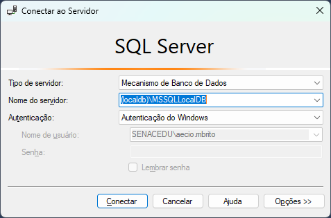

Pode criar um novo script clicando no botão "Nova Consulta"
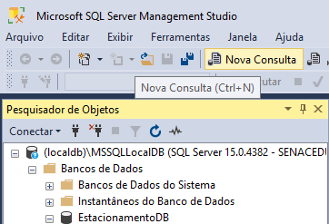

### Criação do Banco de Dados

Escreva seu script de criação do banco d dados, como o do exemplo a seguir. Execute o script:

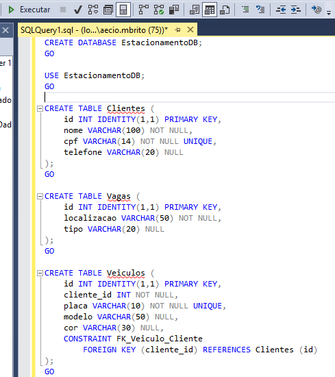

Após a execução, atualize a lista de bancos de dados e o verifique o resultado da criação do seu banco.
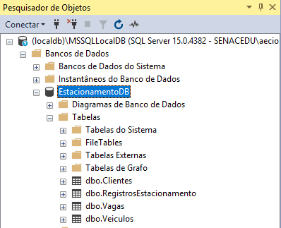

## Aplicação

Abra o Visual Studio 2022 e clique na opção "Criar um projeto"
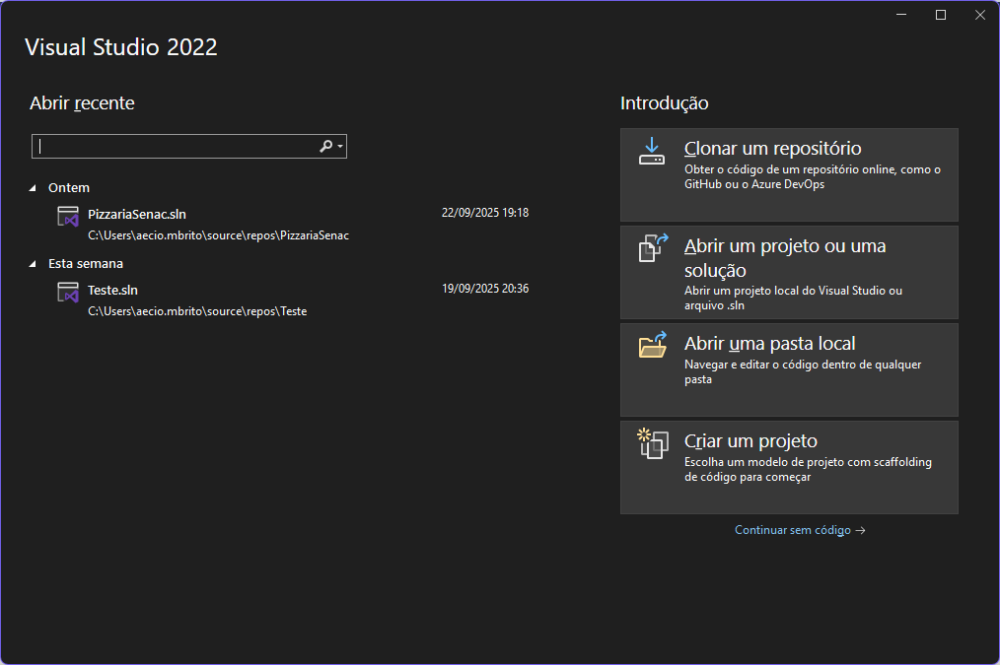

Selecione a opção *Aplicativo Web do ASP.NET Core (Model-View-Controller)*
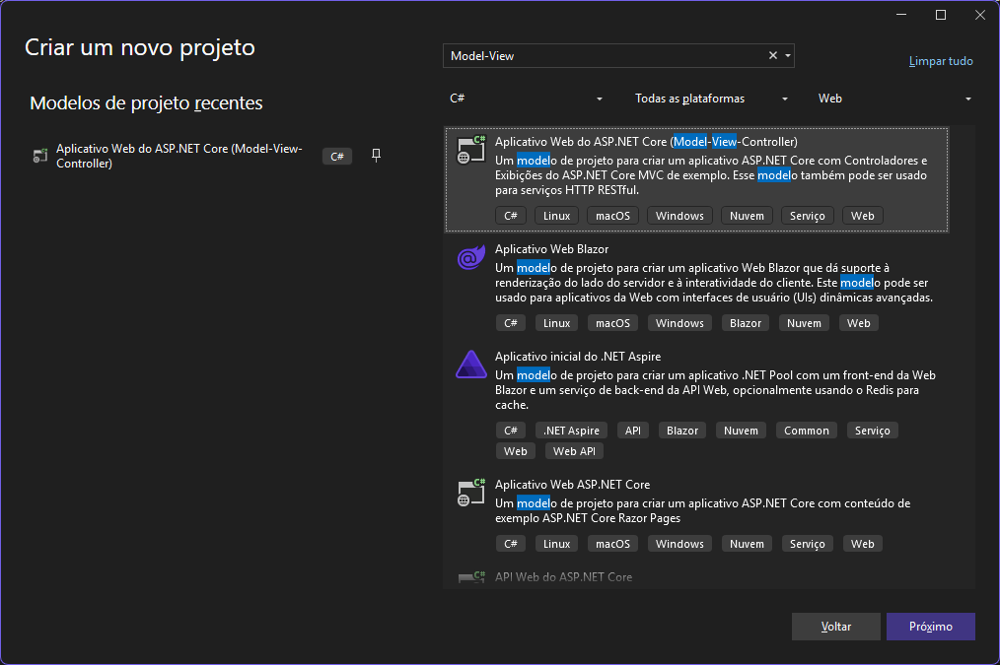

Escolha o nome do projeto e diretório de criação.
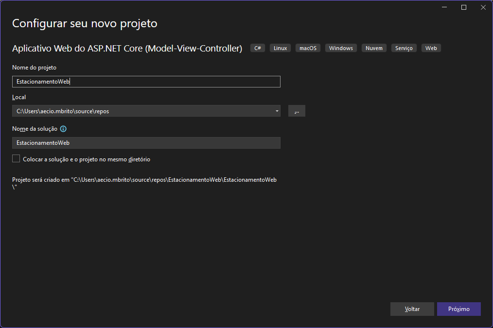

Para nossos projetos, estamos utilizando o .Net 8, mas os mesmos comandos são possíveis em versões anteriores ou posteriores (adapte os packages instalados posteriormente de acordo com a versão)
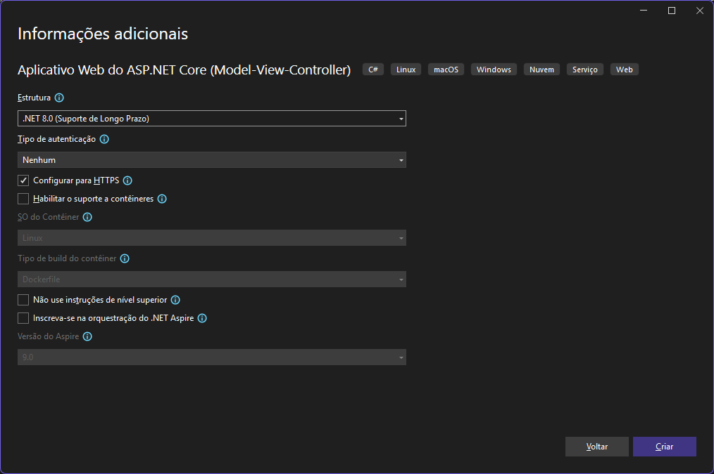

Com o projeto criado, recomendo a execução em HTTP ao invés de HTTPS para não ter problemas com certificados. Siga para o menu *"Ferrametnas>Gerenciador de Pacotes do NuGet>Gerenciador de Pacotes para a Solução"*
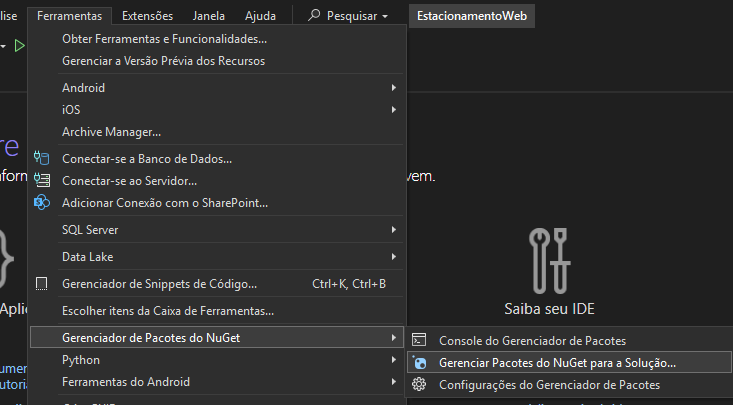

Instale os pacotes listados aqui. **Note que instalei a versão 8 dos mesmos, apesar de ter a versão 9 disponível. Isso por usar o .Net 8**
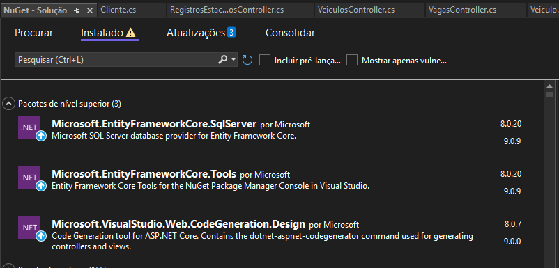

Localize seu appsettings.json
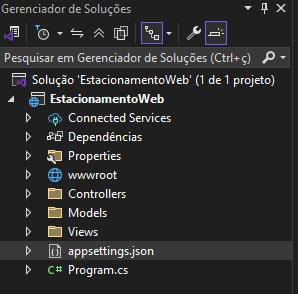

Nele, adicione uma seção para a ConnectionString
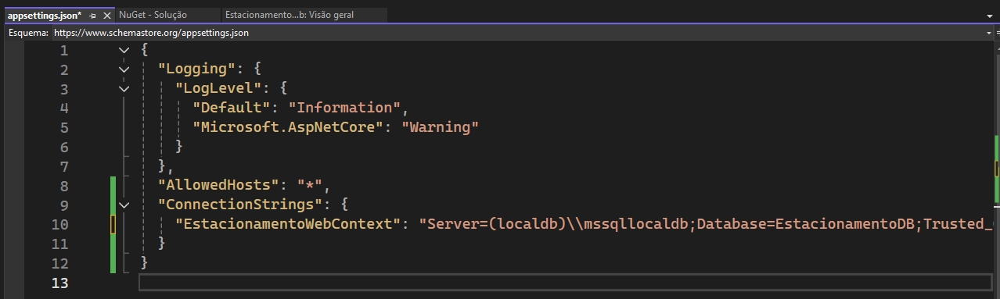


Copie e cole essa connectionString, altere conforme o nome do banco de dados da sua aplicação.

```json
"ConnectionStrings": {
  "Default": "Server=(localdb)\\mssqllocaldb;Database=EstacionamentoDB;Trusted_Connection=True;"
}
```
Execute esse comando no console do package manager para gerar as Models do seu projeto a partir do Banco de Dados
```Csharp
Scaffold-DbContext "Server=(localdb)\MSSQLLocalDB;Database=EstacionamentoDB;Trusted_Connection=True;TrustServerCertificate=True;" Microsoft.EntityFrameworkCore.SqlServer -OutputDir Models
```
Localize no explorador de arquivos do seu projeto o arquivo *Program.cs*
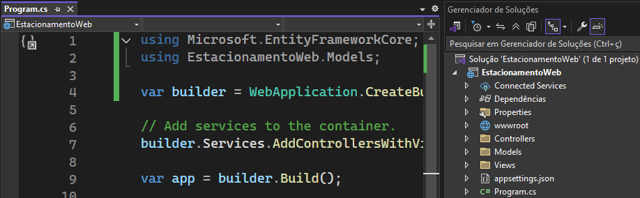

Nele, adicione os usings para

```CSharp
using Microsoft.EntityFrameworkCore;
using EstacionamentoWeb.Models;
```
Adicione o trecho de código a seguir conforme a imagem informada, utilizando a classeu do seu DbContext:

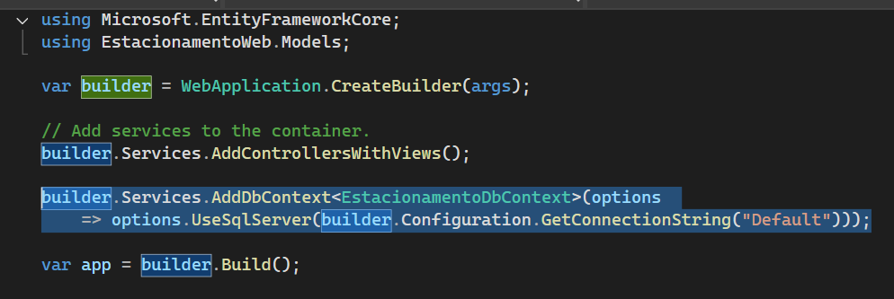

```CSharp
builder.Services.AddDbContext<EstacionamentoDbContext>(options 
    => options.UseSqlServer(builder.Configuration.GetConnectionString("Default")));
```

---

Agora basta criar as Controllerse Views pelo processo de geração automática de código.